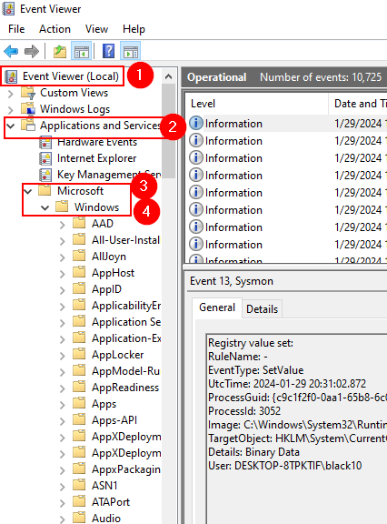

# ⏰ Configure Wazuh Alerts

We have to start with Wazuh config file. our intension is to configure mimikatz alert to the Wazuh server.

You can find the Wazuh agent configurations under the **C:\Program Files (x86)\ossec-agent**

We are trying to edit the file called **ossec.conf**

<figure><figcaption>
ossec.conf file
</figcaption></figure>

Before we are going to do any modifications, we have to backup the ossec.conf file. I will simply go ahead and make a copy and name that file as **“ ossec-backp.conf.”**

After you open the **ossec.conf** file just scroll down and then you will see the log analysis file tag.&#x20;

That part is the important part to us for this demo.

<figure><figcaption>
ossec.conf file log analysis tag
</figcaption></figure>

In here what we are going to do is copy the local file tag and past under the local file tag. We want add the **Sysmon** (which we have installed initially) as our application location.

<figure><figcaption>
ossec.conf Local File Tag
</figcaption></figure>

We have to replace that application name with the Sysmon application name. How we can find the name ?

It is relatively easy, please follow the following path to find the real name.


Windows even viewer — >Application and services —> Microsoft —> Windows —> Sysmon —>operational —> right click on the operational go to properties and copy the full name


<figure><figcaption>
Sysmon Application Path
</figcaption></figure>

<figure><figcaption>
Sysmon Application Path
</figcaption></figure>

<figure><figcaption>
Sysmon Application Full Name
</figcaption></figure>

Now paste the copied Full name under the application location in ossc.config file.

Also I'll remove the duplicated application name **security and system** file tags and save it. This means it will no longer forward the event logs to the Wazuh manager.

<figure><figcaption>
ossec.conf File Configurations
</figcaption></figure>

Next step is restart the Wazuh service in our client PC ( same PC). go ahead and open the **windows services— > find the Wazuh service** and restart.

<figure><figcaption>
Wazuh Agent Service Restart
</figcaption></figure>


If you have changed the configuration, then  you must restart the service.


Come back to the Wazuh dashboard, open security events and go inside. Then click events and under events search Sysmon. Some times this might take time to retrieve the Sysmon logs. Be patient and wait until you receive the logs.

<figure><figcaption>
Wazuh Sysmon Logs
</figcaption></figure>

Our next step is to download the Mimikatz to the client machine. (Windows 10 VM). Make sure that you have **disabled** the windows defender before download the Mimikatz, cause that will detect and delete the Mimikatz.



once downloaded, extract the Mimikatz like this

<figure><figcaption>
Mimikatz
</figcaption></figure>

